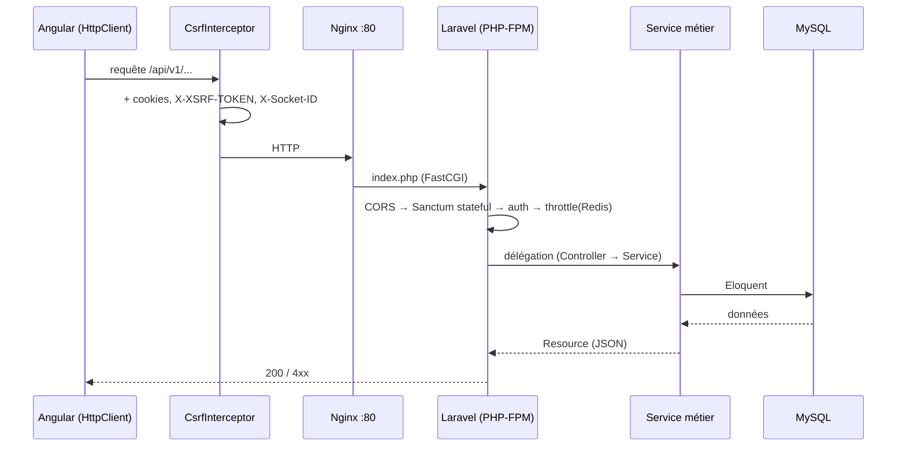
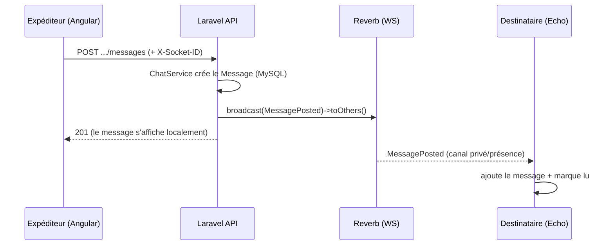

# ScholarFlow — Résumé de l'architecture

> Plateforme de gestion de stages (PFA). **Backend** Laravel 12 (PHP 8.2, architecture orientée Domaine) — **Frontend** Angular 16 (NgRx) — **Temps réel** Laravel Reverb (WebSocket) — Le tout orchestré par **Docker Compose**.

---

## 1. Vue d'ensemble & infrastructure Docker

L'application tourne dans une stack `docker-compose.yml` de plusieurs conteneurs reliés par le réseau `pfa_network` :

| Conteneur | Image / Rôle | Détail |
|-----------|--------------|--------|
| `nginx` | nginx:1.25 | Reverse-proxy + serveur web. Écoute le port **80**, sert le build Angular statique et redirige tout le trafic dynamique vers PHP-FPM. Proxy WebSocket vers Reverb. |
| `php-fpm` | Build custom (`docker/php`) | Exécute le code Laravel (API REST). |
| `reverb` | `php artisan reverb:start` | Serveur **WebSocket** natif Laravel, port **8080**. Diffuse les événements temps réel. |
| `queue-worker` | `php artisan queue:work redis` | Traite les jobs asynchrones (notifications, e-mails) depuis les files Redis `broadcasts,default`. |
| `scheduler` | `php artisan schedule:work` | Tâches planifiées (CRON applicatif). |
| `mysql` | mysql:8.0 | Base de données relationnelle principale (`pfa_db`). |
| `redis` | redis:7 | Cache, sessions, files d'attente, rate-limiting. |
| `mailpit` | axllent/mailpit | Capture des e-mails en développement (UI sur 8025). |

L'application s'appelle **ScholarFlow** (`APP_NAME`), locale **fr** par défaut.

---

## 2. Architecture en couches

### 2.1 Backend — Domain-Driven Design (DDD)

Le code n'est pas organisé « par type technique » classique, mais **par domaine métier**. Chaque domaine (`Auth`, `Chat`, `Stage`, `Document`, `Reunion`, `Feedback`, `Notification`, `Rapport`, `Etablissement`) regroupe ses propres Services, Events, Notifications, Policies et parfois Models.

```
app/
├── Http/            ← Couche présentation/transport (HTTP)
│   ├── Controllers/Api/V1   ← Points d'entrée REST (versionnés v1)
│   ├── Requests/V1          ← Validation des entrées (FormRequest)
│   ├── Resources/V1         ← Transformation des sorties en JSON
│   └── Middleware/          ← EnsureRole, ForcePasswordChange, SecurityHeaders
├── Domain/          ← Couche métier (cœur de l'application)
│   └── <Domaine>/Services   ← Logique métier réutilisable
│       /Events             ← Événements diffusables (broadcast)
│       /Notifications      ← Notifications (mail/database/broadcast)
│       /Policies           ← Règles d'autorisation
│       /Observers          ← Réactions aux changements de modèles
├── Models/          ← Entités Eloquent (User, Stage, Message, PrivateChat…)
├── Support/         ← Enums (Role, ChatType, StageStatut…) & Traits
└── Providers/       ← AppServiceProvider (bootstrap : rate limiters, policies…)
```

**Rôle de chaque couche :**

- **Controllers (`Http/Controllers/Api/V1`)** : minces. Ils valident la requête, délèguent au Service du domaine, puis renvoient une `Resource`. Exemple : `ChatController` injecte `ChatService` et n'écrit aucune logique métier lui-même.
- **Requests (`Http/Requests/V1`)** : règles de validation isolées des contrôleurs.
- **Resources (`Http/Resources/V1`)** : formatent la réponse JSON (ex. `MessageResource`, `PrivateChatResource`) — la forme exposée au front est découplée du modèle.
- **Middleware** : filtres transverses. `EnsureRole` (RBAC), `ForcePasswordChange` (oblige le 1er changement de mot de passe), `SecurityHeaders` (en-têtes de sécurité ajoutés à chaque réponse).
- **Services (`Domain/*/Services`)** : contiennent **toute la logique métier** (création de messages, calcul des non-lus, planification de réunions…). C'est la couche testable et réutilisable.
- **Events** : objets diffusés en temps réel via Reverb (ex. `MessagePosted`).
- **Notifications** : messages multi-canaux (mail + base + broadcast).
- **Models (Eloquent)** : accès aux données + relations.
- **Support/Enums** : types métiers stricts (PHP 8.1+ enums) garantissant la cohérence des statuts/rôles.
- **Providers** : configuration au démarrage (limiteurs de débit, policies, règles de mot de passe, HTTPS forcé en prod).

### 2.2 Frontend — Angular 16 modulaire

```
src/app/
├── core/            ← Services singletons, infrastructure transverse
│   ├── auth/        ← AuthService + guards (auth, role, force-password)
│   ├── http/        ← Intercepteurs HTTP (CsrfInterceptor, ErrorInterceptor)
│   ├── realtime/    ← EchoService (connexion WebSocket Reverb)
│   ├── services/    ← Services API (un par domaine : chat, stage, notification…)
│   └── models/      ← Interfaces TypeScript (DTO)
├── store/           ← État global NgRx (auth, filter, notifications, realtime)
├── features/        ← Modules métier lazy (stages, messaging, meetings,
│                       notifications, dashboards, students…)
├── layout/          ← AuthLayout / AuthenticatedLayout (coquilles d'affichage)
└── shared/          ← Composants/pipes/directives réutilisables
```

**Rôle de chaque couche :**

- **`core/`** : tout ce qui est instancié une seule fois — authentification, intercepteurs, connexion temps réel, et un **service API par domaine** (`ChatApiService`, `NotificationApiService`, etc.) qui encapsule les appels `HttpClient`.
- **`store/` (NgRx)** : gestion d'état réactive (Store + Effects). L'utilisateur courant (`auth`), les filtres globaux et l'état temps réel y vivent. Les composants lisent l'état via des *selectors* et déclenchent des *actions*.
- **`features/`** : un module Angular par fonctionnalité, chargé à la demande (lazy loading) via `app-routing.module.ts`.
- **`layout/`** : `AuthenticatedLayoutComponent` est la coquille de l'app connectée — c'est elle qui ouvre la connexion Echo et écoute les notifications globales.
- **`shared/`** : briques UI réutilisables (badges de statut, dialog de confirmation, toasts, etc.).

---

## 3. Rate limiter (limitation de débit)

Deux limiteurs sont définis dans `App\Providers\AppServiceProvider::boot()` :

```php
// 5 tentatives / minute, indexées par adresse IP → protège le login & les mots de passe
RateLimiter::for('auth', fn (Request $r) =>
    Limit::perMinute(5)->by($r->ip())->response(fn () =>
        response()->json(['message' => 'Trop de tentatives…'], 429)));

// 120 requêtes / minute, indexées par utilisateur connecté (sinon par IP)
RateLimiter::for('api', fn (Request $r) =>
    Limit::perMinute(120)->by($r->user()?->id ?: $r->ip()));
```

**Comment c'est appliqué :** via le middleware `throttle` directement sur les routes (`routes/api.php`) :

- Routes publiques d'authentification → `middleware('throttle:auth')` (login, forgot-password, reset-password, accept-invitation). **5 req/min/IP**.
- Tout le groupe authentifié `v1` → `middleware(['auth:sanctum', 'throttle:api'])`. **120 req/min/utilisateur**.

**Lien avec Redis :** le middleware `throttle` stocke ses compteurs dans le **cache** de Laravel. Comme `CACHE_STORE=redis` (voir `.env`), **les compteurs de rate-limiting sont conservés dans Redis** (connexion `cache`, base de données Redis n°1). Avantage : la limite est partagée entre tous les conteneurs PHP-FPM, et persiste indépendamment des processus. Quand la limite est dépassée, Laravel renvoie un **HTTP 429** (avec le message FR personnalisé pour `auth`).

---

## 4. Redis — rôles dans le projet

Redis (`REDIS_CLIENT=phpredis`, hôte `redis:6379`) joue **quatre rôles** simultanés. La configuration est dans `config/database.php` (section `redis`), qui définit deux connexions logiques : `default` (base 0) et `cache` (base 1), avec un préfixe `scholarflow-database-`.

| Usage | Variable `.env` | Détail |
|-------|-----------------|--------|
| **Cache applicatif** | `CACHE_STORE=redis` | Cache général + **compteurs de rate-limiting**. Base Redis n°1. |
| **Sessions** | `SESSION_DRIVER=redis` | Les sessions (et donc l'auth Sanctum SPA) sont stockées dans Redis → partage entre conteneurs. |
| **Files d'attente** | `QUEUE_CONNECTION=redis` | Les jobs (notifications, e-mails) sont poussés dans Redis et consommés par le conteneur `queue-worker` (files `broadcasts,default`). |
| **Broadcasting** | `BROADCAST_CONNECTION=reverb` | Reverb diffuse les événements ; le worker `broadcasts` met en file les diffusions asynchrones. |

> En résumé : Redis est la **mémoire partagée et rapide** de l'app (cache, sessions, limites de débit) et le **tampon asynchrone** (files de jobs) entre l'API et les workers.

---

## 5. Cheminement d'une requête : du Front au Back

L'authentification utilise **Laravel Sanctum en mode SPA** (cookies, pas de token Bearer). Le front (`localhost:4200`) et l'API (`localhost`) partagent le cookie de session.

### Étapes (requête HTTP classique)

1. **Composant Angular** appelle un service API (ex. `ChatApiService.sendPrivateMessage()`), qui utilise `HttpClient` vers `http://localhost/api/v1/...`.
2. **`CsrfInterceptor`** (`core/http`) intercepte la requête :
   - ajoute `withCredentials: true` (envoie les cookies) ;
   - pour les méthodes mutatives (POST/PUT/PATCH/DELETE), ajoute l'en-tête `X-XSRF-TOKEN` (lu depuis le cookie `XSRF-TOKEN`) **et** `X-Socket-ID` (id du WebSocket, voir §6).
3. **Nginx** (port 80) reçoit la requête. Tout ce qui n'est pas un fichier statique est renvoyé à `index.php` → **PHP-FPM**.
4. **`bootstrap/app.php`** applique le pipeline de middleware global :
   - `HandleCors` (CORS avec credentials) en premier ;
   - `statefulApi()` de Sanctum → rend l'API « stateful » (auth par cookie de session) ;
   - validation CSRF (sauf `sanctum/csrf-cookie`) ;
   - `SecurityHeaders` ajouté à toutes les réponses ;
   - `trustProxies('*')` (car derrière nginx).
5. **Routage** (`routes/api.php`) : la route correspond, on traverse `auth:sanctum` (vérifie la session) → `throttle:api` (rate limit Redis) → `force.password.change`.
6. **Controller** valide et délègue au **Service** du domaine.
7. **Service** exécute la logique métier et interroge les **Models Eloquent** (→ MySQL).
8. La réponse repart en JSON via une **Resource**, traverse les intercepteurs Angular en sens inverse (`ErrorInterceptor` gère les 401 → redirection `/login`, et le 403 `PASSWORD_CHANGE_REQUIRED`).

### Flux d'amorçage de session (avant le login)

`AuthService.csrfCookie()` appelle `GET /sanctum/csrf-cookie` → Laravel pose le cookie `XSRF-TOKEN`. Ensuite `POST /api/login` ouvre la session (stockée dans Redis). À partir de là, chaque requête authentifiée renvoie automatiquement le cookie de session.



---

## 6. Messagerie temps réel

Le temps réel repose sur **Laravel Reverb** (serveur WebSocket) côté back et **Laravel Echo + pusher-js** côté front. L'événement central est `MessagePosted` (`Domain/Chat/Events`), qui implémente `ShouldBroadcastNow` (diffusion immédiate, synchrone au moment de l'envoi).

### Connexion WebSocket (`EchoService`, `core/realtime`)

- À l'ouverture de la zone connectée, `AuthenticatedLayoutComponent` appelle `echo.connect()`.
- Echo est instancié avec le *broadcaster* `reverb` et se connecte au WebSocket (`localhost:8080`).
- **Astuce clé du projet** : un *authorizer* personnalisé utilise `fetch(..., { credentials: 'include' })` vers `/broadcasting/auth`. C'est nécessaire car l'auth XHR native de pusher-js n'envoie pas `withCredentials`, donc le cookie de session Sanctum ne partirait pas, et les abonnements aux canaux privés/présence échoueraient silencieusement.
- L'autorisation des canaux côté back passe par `Broadcast::routes(['middleware' => ['auth:sanctum']])` (dans `AppServiceProvider`).
- Echo tourne **hors zone Angular** (`runOutsideAngular`) pour éviter des cycles de détection de changement inutiles ; les callbacks sont réinjectés dans la zone via `ngZone.run()`.

### 6.1 Messagerie PRIVÉE (enseignant ↔ étudiant)

- **Modèle** : `PrivateChat` (paire `enseignant_id` / `etudiant_id`). Créé/récupéré via `ChatService::getOrCreatePrivateChat()` (réservé aux paires enseignant↔étudiant).
- **Canal** : `chat.{chatId}` — un **PrivateChannel**. L'autorisation (`routes/channels.php`) vérifie que l'utilisateur est bien l'enseignant **ou** l'étudiant de ce chat.
- **Envoi** : `POST /api/v1/chats/private/{chat}/messages` → `ChatService::sendPrivateMessage()` crée le `Message` (type `private`), puis `broadcast(new MessagePosted($message))->toOthers()`.
- **`->toOthers()`** : le message n'est PAS renvoyé à l'expéditeur via WebSocket (il l'affiche déjà localement après la réponse HTTP). Cela fonctionne grâce à l'en-tête `X-Socket-ID` envoyé par `CsrfInterceptor`.
- **Réception** : `MessagingComponent` s'abonne à `privateChannel('chat.{id}')` et écoute `.MessagePosted`. À réception, le message est ajouté à la liste et marqué comme lu si le chat est ouvert.

### 6.2 Messagerie de GROUPE (chat d'un stage)

- **Modèle** : `PublicChat` (un par stage). Les participants = l'enseignant + les étudiants **affectés actifs** au stage.
- **Canal** : `stage.{stageId}` — un **PresenceChannel** (canal de présence : on sait qui est en ligne). L'autorisation (`routes/channels.php`) renvoie l'identité + le rôle si l'utilisateur encadre le stage ou y est affecté (`AffectationStatut::Actif`), sinon refuse.
- **Envoi** : `POST /api/v1/chats/public/{chat}/messages` → `ChatService::sendPublicMessage()` (après contrôle d'accès `authorizePublicChat`), crée le `Message` (type `public`) puis `broadcast(new MessagePosted($message, $chat->stage_id))->toOthers()`.
- **Aiguillage du canal** : `MessagePosted::broadcastOn()` choisit dynamiquement → `PresenceChannel("stage.{id}")` si le message est public, sinon `PrivateChannel("chat.{id}")`.
- **Réception** : `StageChatComponent` rejoint `presenceChannel('stage.{id}')` et écoute `.MessagePosted`.

### Accusés de lecture & compteurs de non-lus

- Table `message_reads` (modèle `MessageRead`). `markPrivateChatRead()` insère en masse les lectures manquantes.
- `unreadCountForChat()` / `totalUnreadPrivate()` calculent les non-lus (sous-requête `whereNotExists` sur `message_reads`).
- Côté front, `ChatApiService` expose un `BehaviorSubject` `unreadPrivate$` ; le layout fait aussi un *polling* de secours toutes les 30 s.



---

## 7. Notifications

Les notifications utilisent le **système de notifications natif de Laravel**, multi-canaux. Exemple représentatif : `MeetingInvitationNotification` (`Domain/Notification/Notifications`).

### Côté back

- La notification implémente `ShouldQueue` → elle est **mise en file Redis** et traitée par le conteneur `queue-worker` (envoi non bloquant).
- Méthode `via()` → trois canaux : **`mail`**, **`database`**, **`broadcast`**.
  - **mail** : e-mail formaté (`toMail`) envoyé via SMTP (Mailpit en dev).
  - **database** : la notification est persistée dans la table `notifications` (`toArray`), récupérable plus tard.
  - **broadcast** : `toBroadcast()` renvoie un `BroadcastMessage`, diffusé en temps réel via Reverb.
- **Déclenchement** : depuis un Service métier. Ex. `ReunionService::planifier()` appelle `Notification::send($participants, new MeetingInvitationNotification($reunion))`.
- **Canal de diffusion** : chaque utilisateur a un canal privé `App.Models.User.{id}` (défini dans `routes/channels.php`, autorisé seulement si `user.id === id`).

### Côté front

- **Temps réel** : `AuthenticatedLayoutComponent` s'abonne à `privateChannel('App.Models.User.{id}')` et utilise `.notification()` ; à chaque notification reçue, il incrémente le compteur de non-lus (`notifApi.incrementUnread()`).
- **API REST** (`NotificationController`) :
  - `GET /api/v1/notifications` → liste paginée + `unread_count`.
  - `POST /api/v1/notifications/{id}/read` → marquer une notification comme lue.
  - `POST /api/v1/notifications/read-all` → tout marquer comme lu.
- **Polling de secours** : le layout recharge la liste toutes les 30 s (au cas où le WebSocket aurait manqué un événement).

> Double mécanisme **push (WebSocket) + pull (polling)** → robustesse : si la connexion temps réel tombe, l'utilisateur voit quand même ses notifications au prochain cycle.

---

## 8. Packages importants et où ils sont utilisés

### Backend (`composer.json`)

| Package | Rôle | Où / comment il est utilisé |
|---------|------|------------------------------|
| `laravel/framework` ^12 | Cœur du framework | Toute l'application. |
| `laravel/reverb` ^1.10 | Serveur WebSocket | Conteneur `reverb` (`reverb:start`) ; diffusion de `MessagePosted` et des notifications broadcast. |
| `laravel/sanctum` ^4 | Authentification SPA par cookie | `statefulApi()` dans `bootstrap/app.php`, middleware `auth:sanctum` sur les routes et l'auth des canaux. |
| `spatie/laravel-data` ^4 | Objets de données typés (DTO) | Structuration des données entre couches (Requests/Resources/Services). |
| `spatie/laravel-query-builder` ^6 | Filtres/tri/includes depuis l'URL | Endpoints de listing (ex. stages) — filtrage et tri sûrs via query string. |
| `dedoc/scramble` ^0.13 | Génération auto de doc OpenAPI | Documentation de l'API REST. |
| `laravel/tinker` | REPL | Débogage / scripts en ligne de commande. |
| `laravel/pail` (dev) | Lecture des logs en direct | Script `composer dev`. |
| `laravel/pint` (dev) | Formateur de code (style PSR) | Qualité de code. |
| `laravel/sail` (dev) | Environnement Docker simplifié | Alternative de dev. |
| `phpunit/phpunit`, `mockery`, `fakerphp/faker` (dev) | Tests & données factices | Dossier `tests/`, factories. |

### Frontend (`package.json`)

| Package | Rôle | Où / comment il est utilisé |
|---------|------|------------------------------|
| `@angular/*` ^16 | Framework SPA | Toute l'application. |
| `@angular/material` + `@angular/cdk` | Composants UI Material | Dialogs, formulaires, calendrier de réunions, layout. |
| `@ngrx/store` + `@ngrx/effects` | Gestion d'état + effets | Dossier `store/` (auth, filter, notifications, realtime). |
| `@ngrx/component-store` | État local de composant | États riches de certains composants/features. |
| `@ngrx/store-devtools` | Débogage du store | Développement (Redux DevTools). |
| `laravel-echo` ^2 | Client de diffusion temps réel | `EchoService` — abonnement aux canaux privés/présence. |
| `pusher-js` ^8 | Transport WebSocket | Bas niveau utilisé par Echo (`window.Pusher`), connexion à Reverb. |
| `@ngx-translate/core` + `http-loader` | Internationalisation (i18n) | Traductions de l'UI (chargées via HTTP). |
| `rxjs` ^7 | Programmation réactive | Partout (services, composants, store). |
| `tailwindcss` (dev) | CSS utilitaire | Styles (`tailwind.config.js`). |
| `cypress` (dev) | Tests end-to-end | Dossier `cypress/` (scripts `e2e`). |
| `zone.js` | Détection de changement Angular | Géré finement par `EchoService` (`runOutsideAngular`). |

---

## 9. Synthèse en une image

```
┌────────────────────────────────────────────────────────────────────┐
│                          NAVIGATEUR                                  │
│   Angular 16 (NgRx)                                                  │
│   ├─ HttpClient + Interceptors (CSRF / erreurs)  ── REST ─────┐      │
│   └─ Laravel Echo + pusher-js  ──────────── WebSocket ──┐     │      │
└────────────────────────────────────────────────────────┼─────┼─────┘
                                                          │     │
                                  ┌───────────────────────┼─────┼──────┐
                                  │           NGINX :80 / proxy WS      │
                                  └───────────┬───────────┴─────┬──────┘
                                              │ FastCGI         │ WS
                                   ┌──────────▼─────┐   ┌───────▼───────┐
                                   │  PHP-FPM        │   │   REVERB      │
                                   │  Laravel (DDD)  │   │  (WebSocket)  │
                                   │  Controllers →  │   └───────▲───────┘
                                   │  Services →     │           │ broadcast
                                   │  Models         │           │
                                   └───┬────────┬────┘           │
                          ┌────────────┘        └──────┐         │
                   ┌──────▼──────┐            ┌─────────▼─────┐   │
                   │   MySQL      │            │    REDIS      │◄──┘
                   │ (données)    │            │ cache/session │
                   └──────────────┘            │ queue/throttle│
                                               └───────▲───────┘
                                                       │ jobs
                                              ┌────────┴────────┐
                                              │  QUEUE-WORKER    │
                                              │ (notifs, mails)  │
                                              └─────────┬────────┘
                                                        │ SMTP
                                                  ┌─────▼─────┐
                                                  │  MAILPIT  │
                                                  └───────────┘
```

**En une phrase :** Angular parle à Laravel en REST (via Nginx, auth par cookie Sanctum, débit limité par Redis), Laravel persiste dans MySQL et délègue l'asynchrone (notifications, e-mails) à des workers Redis, tandis que Reverb pousse en WebSocket les messages (privés via canal privé, groupe via canal de présence) et les notifications vers les bons utilisateurs en temps réel.
