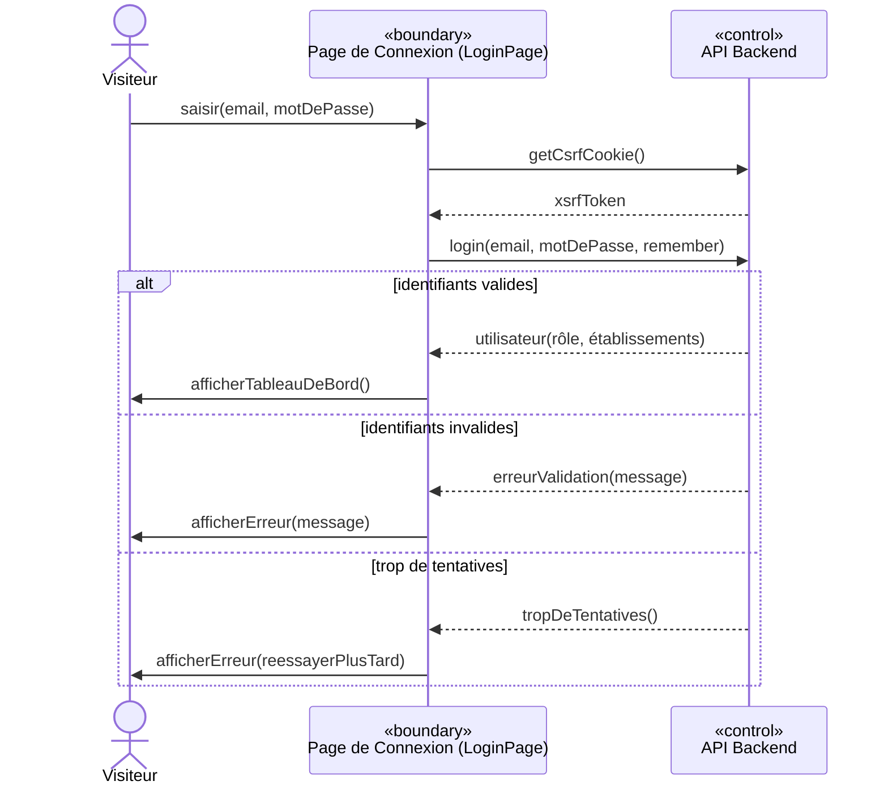
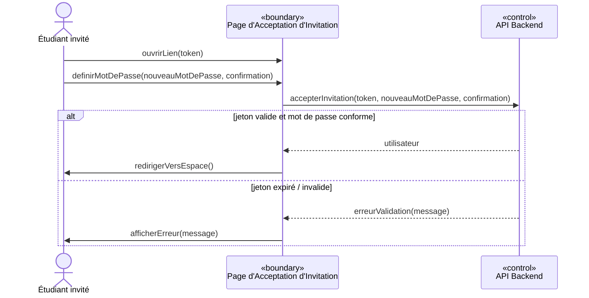
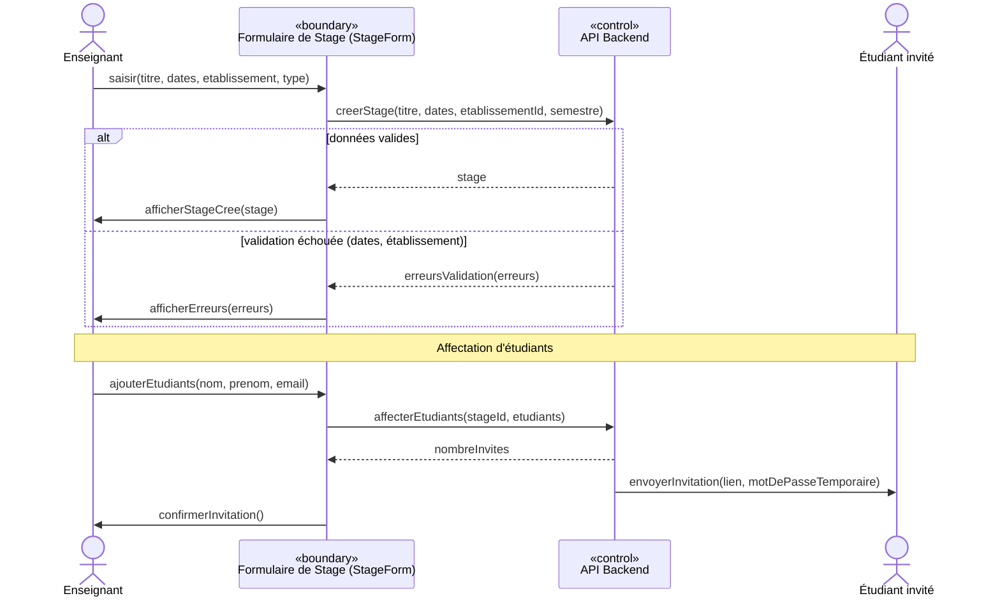
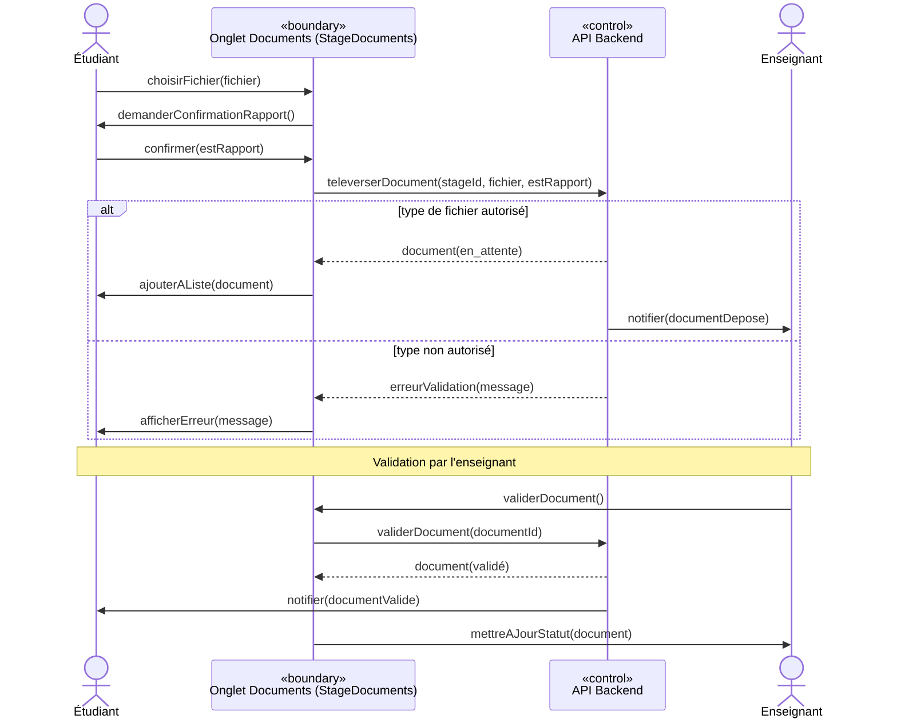
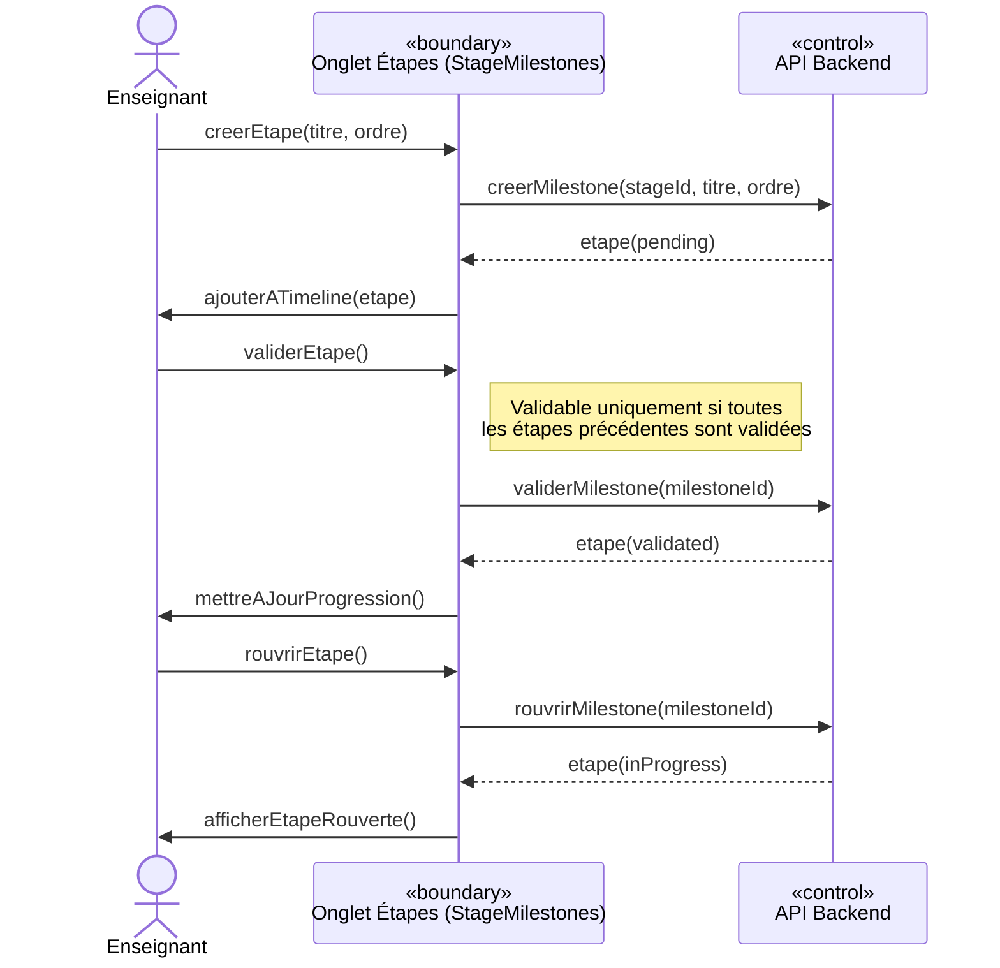
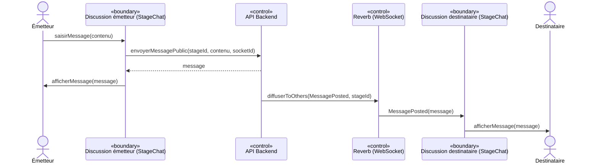
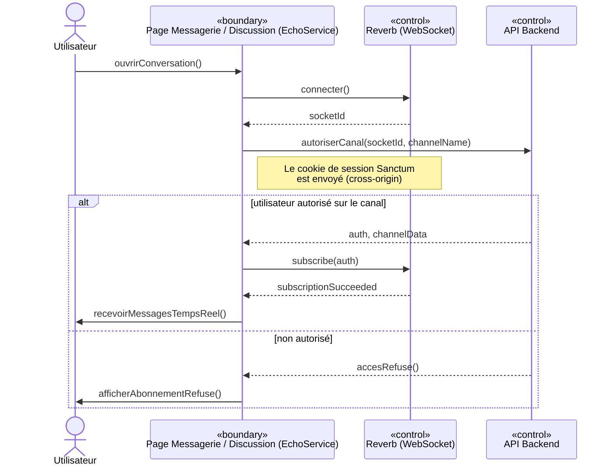
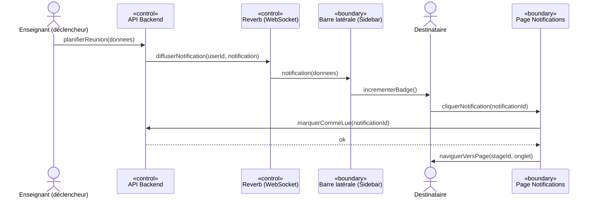

# Diagrammes de séquence — Scripts Mermaid

> Versions Mermaid des 8 diagrammes de séquence (Sprints 1 à 3).
> Mermaid ne possède pas les icônes UML «boundary/control/entity» de PlantUML ;
> le stéréotype est donc indiqué en texte dans le libellé de chaque participant.
> Convention : `->>` = appel, `-->>` = retour.

---

## Sprint 1 — Authentification & Sécurité

### 1. Se connecter

### 2. Accepter invitation + changement forcé

---

## Sprint 2 — Gestion de Stage

### 3. Créer un stage + inviter des étudiants

### 4. Dépôt + validation d'un document

### 5. Cycle de vie d'une étape

---

## Sprint 3 — Tableaux de bord, Messagerie & Notifications

### 6. Message de groupe en temps réel

### 7. Abonnement & authentification d'un canal privé

### 8. Notification temps réel + navigation

