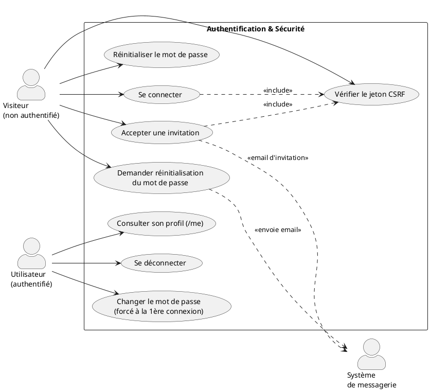
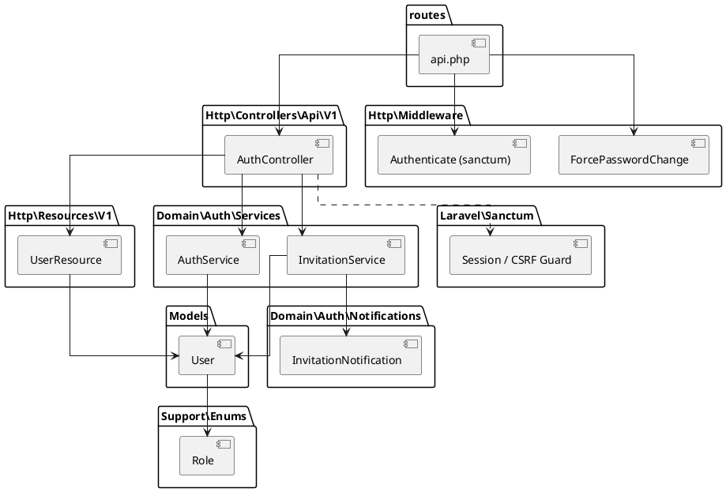
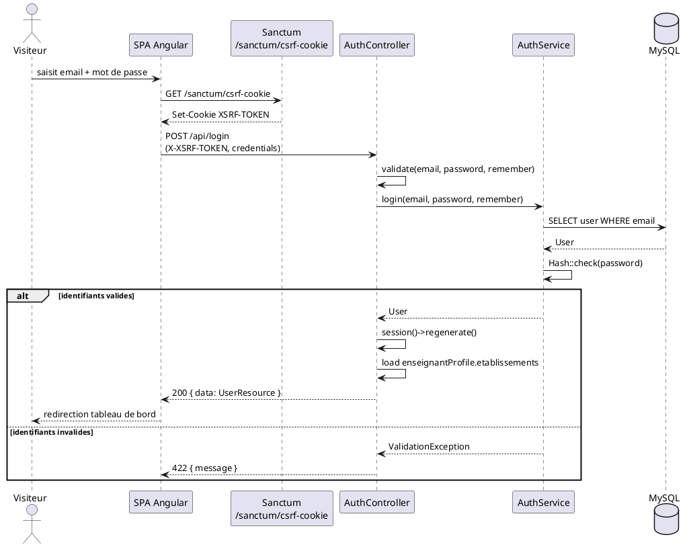
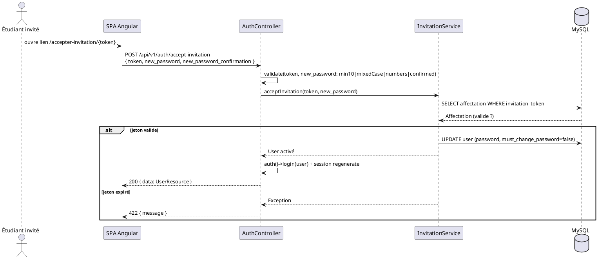

# Sprint 1 — Authentification & Sécurité (2 semaines)

> Projet **ScholarFlow** — Plateforme de gestion et de suivi des stages académiques
> Backend : Laravel 12 (PHP 8.2) · Authentification SPA via Laravel Sanctum (cookies de session)
> Frontend : Angular 16

---

## 1. Introduction

Ce premier sprint pose les fondations de sécurité de la plateforme **ScholarFlow**. L'objectif
est de mettre en place un mécanisme d'authentification robuste reposant sur **Laravel Sanctum**
(authentification SPA basée sur les cookies de session et la protection CSRF), ainsi que la
gestion du cycle de vie des comptes : connexion, déconnexion, acceptation d'invitation,
changement de mot de passe forcé à la première connexion, et réinitialisation de mot de passe.

La plateforme distingue deux rôles (`enseignant`, `etudiant`) gérés via une énumération `Role`
et appliqués par des *guards* et *policies*. Un middleware `force.password.change` impose la
modification du mot de passe temporaire avant tout accès aux fonctionnalités métier.

À l'issue de ce sprint, un utilisateur peut se connecter de façon sécurisée, et le système
garantit que seuls les comptes vérifiés et au mot de passe défini accèdent à l'application.

---

## 2. Backlog du Sprint

| # | User Story | Priorité | Estimation |
|---|------------|----------|------------|
| US1.1 | En tant qu'utilisateur, je veux me connecter avec email/mot de passe afin d'accéder à mon espace. | Haute | 3 j |
| US1.2 | En tant qu'utilisateur connecté, je veux me déconnecter afin de sécuriser ma session. | Haute | 1 j |
| US1.3 | En tant qu'étudiant invité, je veux accepter une invitation et définir mon mot de passe afin d'activer mon compte. | Haute | 2 j |
| US1.4 | En tant qu'utilisateur, je veux être forcé à changer mon mot de passe temporaire à la première connexion. | Haute | 2 j |
| US1.5 | En tant qu'utilisateur, je veux demander la réinitialisation de mon mot de passe oublié par email. | Moyenne | 2 j |
| US1.6 | En tant qu'utilisateur, je veux réinitialiser mon mot de passe via un lien sécurisé. | Moyenne | 1 j |
| US1.7 | En tant qu'utilisateur connecté, je veux consulter mon profil (`/me`) afin de récupérer mes informations et mon rôle. | Haute | 1 j |
| US1.8 | En tant que système, je veux protéger toutes les routes mutantes par CSRF et limiter les tentatives de connexion (throttle). | Haute | 2 j |

**Définition de « terminé » (DoD)** : APIs testées (Postman/cURL), validations en place,
throttling actif, politique de mot de passe appliquée (min 10, casse mixte, chiffres).

---

## 3. Spécification

### 3.1. Diagramme de cas d'utilisation



### 3.2. Description textuelle

#### CU « Se connecter »
| Champ | Détail |
|-------|--------|
| **Acteur** | Visiteur |
| **Pré-condition** | Le compte existe et est vérifié. Un cookie CSRF a été obtenu. |
| **Scénario nominal** | 1. Le visiteur soumet `email` + `password`. 2. Le système valide les identifiants via `AuthService::login`. 3. La session est régénérée. 4. Les informations utilisateur (avec rôle, établissements si enseignant) sont retournées. |
| **Scénario alternatif** | 2a. Identifiants invalides → `422` avec message d'erreur. 2b. Trop de tentatives (> 5/min) → `429`. |
| **Post-condition** | Une session authentifiée est établie (cookie `laravel_session`). |

#### CU « Accepter une invitation »
| Champ | Détail |
|-------|--------|
| **Acteur** | Visiteur (étudiant invité) |
| **Pré-condition** | Un jeton d'invitation valide (≤ 7 jours) a été reçu par email. |
| **Scénario nominal** | 1. L'utilisateur soumet `token` + `new_password` (+ confirmation). 2. `InvitationService::acceptInvitation` valide le jeton et active le compte. 3. L'utilisateur est connecté automatiquement. |
| **Scénario alternatif** | 2a. Jeton expiré/invalide → `422`. |
| **Post-condition** | Le compte est actif, `must_change_password = false`, session ouverte. |

#### CU « Changer le mot de passe (forcé) »
| Champ | Détail |
|-------|--------|
| **Acteur** | Utilisateur authentifié avec `must_change_password = true` |
| **Pré-condition** | Première connexion avec mot de passe temporaire. |
| **Scénario nominal** | 1. L'utilisateur soumet `current_password` + `new_password` (confirmé). 2. La politique (min 10, casse mixte, chiffres) est vérifiée. 3. Le flag `must_change_password` passe à `false`. |
| **Scénario alternatif** | 2a. Mot de passe actuel erroné → `422`. 2b. Politique non respectée → `422`. |
| **Post-condition** | Accès débloqué aux routes protégées par `force.password.change`. |

#### CU « Réinitialiser le mot de passe »
| Champ | Détail |
|-------|--------|
| **Acteur** | Visiteur |
| **Scénario nominal** | 1. `forgot-password` envoie un lien (token) par email. 2. `reset-password` consomme le token + `email` + nouveau mot de passe. 3. Le mot de passe est réinitialisé. |
| **Scénario alternatif** | 2a. Token invalide/expiré → `422`. |

---

## 4. Conception — Côté Backend

### 4.1. Diagramme de paquetages



### 4.2. Diagramme de séquence — « Se connecter »



### 4.3. Diagramme de séquence — « Accepter invitation + changement forcé »



---

## 5. Réalisation

### 5.1. Côté Backend — Tests des APIs (cURL / Postman)

> **Authentification SPA Sanctum** : toutes les requêtes mutantes nécessitent
> (1) un cookie `XSRF-TOKEN` obtenu via `/sanctum/csrf-cookie`, renvoyé dans
> l'en-tête `X-XSRF-TOKEN`, et (2) le partage des cookies de session (`-c`/`-b` cookie jar).
>
> Base URL : `http://localhost`

#### Helper — récupérer le cookie CSRF (à exécuter en premier)

```bash
# 1) Obtenir le cookie CSRF et stocker tous les cookies dans cookies.txt
curl -s -c cookies.txt http://localhost/sanctum/csrf-cookie

# 2) Extraire le token XSRF (décodé URL) dans une variable réutilisable
XSRF=$(grep XSRF-TOKEN cookies.txt | awk '{print $7}' | sed 's/%3D/=/g')
echo "XSRF=$XSRF"
```

#### US1.1 — Se connecter

```bash
curl -s -X POST http://localhost/api/login \
  -b cookies.txt -c cookies.txt \
  -H "Content-Type: application/json" \
  -H "Accept: application/json" \
  -H "X-XSRF-TOKEN: $XSRF" \
  -d '{
    "email": "enseignant@scholarflow.tn",
    "password": "Password123",
    "remember": true
  }'
# 200 → { "data": { "id":1, "role":"enseignant", "nom_complet":"...", ... } }
```

#### US1.7 — Consulter son profil

```bash
curl -s http://localhost/api/v1/me \
  -b cookies.txt \
  -H "Accept: application/json"
# 200 → { "data": { ...UserResource... } }
```

#### US1.4 — Changer le mot de passe (forcé)

```bash
curl -s -X POST http://localhost/api/v1/auth/change-password \
  -b cookies.txt -c cookies.txt \
  -H "Content-Type: application/json" \
  -H "Accept: application/json" \
  -H "X-XSRF-TOKEN: $XSRF" \
  -d '{
    "current_password": "TempPass123",
    "new_password": "NewSecret123",
    "new_password_confirmation": "NewSecret123"
  }'
# 200 → { "message": "Mot de passe modifié avec succès." }
```

#### US1.3 — Accepter une invitation

```bash
curl -s -X POST http://localhost/api/v1/auth/accept-invitation \
  -b cookies.txt -c cookies.txt \
  -H "Content-Type: application/json" \
  -H "Accept: application/json" \
  -H "X-XSRF-TOKEN: $XSRF" \
  -d '{
    "token": "INVITATION_TOKEN_RECU_PAR_EMAIL",
    "new_password": "EtudiantPass1",
    "new_password_confirmation": "EtudiantPass1"
  }'
# 200 → { "data": { ...UserResource... } }
```

#### US1.5 — Mot de passe oublié

```bash
curl -s -X POST http://localhost/api/v1/auth/forgot-password \
  -b cookies.txt -c cookies.txt \
  -H "Content-Type: application/json" \
  -H "Accept: application/json" \
  -H "X-XSRF-TOKEN: $XSRF" \
  -d '{ "email": "etudiant@scholarflow.tn" }'
# 200 → { "message": "Si cet email existe, un lien de réinitialisation a été envoyé." }
```

#### US1.6 — Réinitialiser le mot de passe

```bash
curl -s -X POST http://localhost/api/v1/auth/reset-password \
  -b cookies.txt -c cookies.txt \
  -H "Content-Type: application/json" \
  -H "Accept: application/json" \
  -H "X-XSRF-TOKEN: $XSRF" \
  -d '{
    "token": "RESET_TOKEN_RECU_PAR_EMAIL",
    "email": "etudiant@scholarflow.tn",
    "password": "ResetPass123",
    "password_confirmation": "ResetPass123"
  }'
# 200 → { "message": "Mot de passe réinitialisé avec succès." }
```

#### US1.2 — Se déconnecter

```bash
curl -s -X POST http://localhost/api/logout \
  -b cookies.txt -c cookies.txt \
  -H "Accept: application/json" \
  -H "X-XSRF-TOKEN: $XSRF"
# 204 No Content
```

#### Test de sécurité — Throttling (US1.8)

```bash
# 6 tentatives rapides → la 6ᵉ doit renvoyer 429
for i in $(seq 1 6); do
  curl -s -o /dev/null -w "tentative $i → %{http_code}\n" \
    -X POST http://localhost/api/login \
    -b cookies.txt -H "Content-Type: application/json" -H "Accept: application/json" \
    -H "X-XSRF-TOKEN: $XSRF" \
    -d '{"email":"x@x.tn","password":"wrong"}'
done
# → tentative 6 → 429 (Trop de tentatives)
```

> **Import Postman** : créez un *Environment* avec la variable `base_url = http://localhost`,
> activez « *Send cookies automatically* », et ajoutez un *Pre-request Script* global qui lit le
> cookie `XSRF-TOKEN` et le place dans l'en-tête `X-XSRF-TOKEN`.

### 5.2. Côté Frontend — Interfaces réalisées

- **Page de connexion** (`/login`) — formulaire email/mot de passe, gestion des erreurs 422/429.
- **Page d'acceptation d'invitation** (`/accepter-invitation/:token`) — définition du mot de passe.
- **Page « Mot de passe oublié »** (`/mot-de-passe-oublie`).
- **Page de changement de mot de passe forcé** (`/changer-mot-de-passe`) — protégée par `forcePasswordGuard`.
- **Gardes de routes** : `isAuthenticatedGuard`, `forcePasswordGuard`, `canActivateForRole`.
- **Intercepteur CSRF** : injection automatique de `X-XSRF-TOKEN` sur les requêtes mutantes.
- **Initialiseur d'application** : `loadMe()` au démarrage pour restaurer la session.

> *(Captures d'écran des interfaces à insérer ici.)*

---

## 6. Conclusion

Ce sprint a livré le socle sécuritaire de ScholarFlow : authentification SPA par cookies Sanctum
avec protection CSRF, limitation des tentatives (throttle 5/min), politique de mot de passe stricte
(≥ 10 caractères, casse mixte, chiffres), invitation par email avec activation de compte, et
changement de mot de passe forcé à la première connexion. La séparation des rôles
(`enseignant`/`etudiant`) via énumération et *policies* prépare le terrain pour les autorisations
métier du **Sprint 2 — Gestion de stage**.
