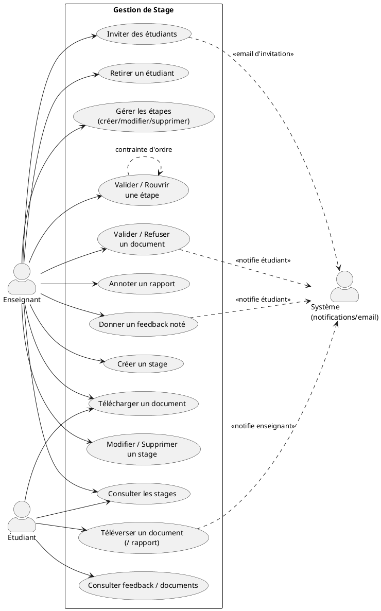
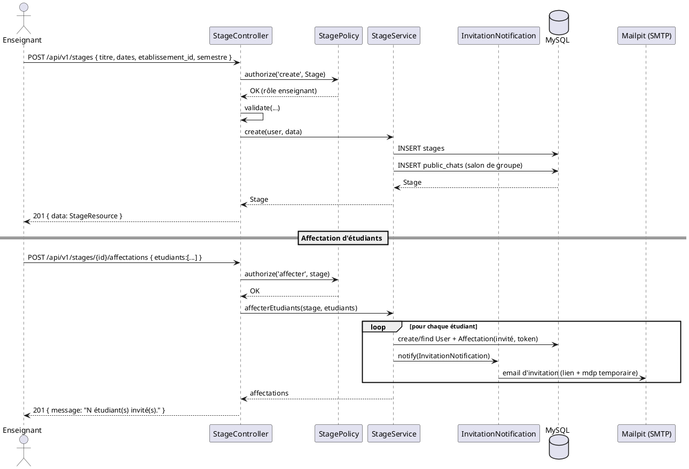
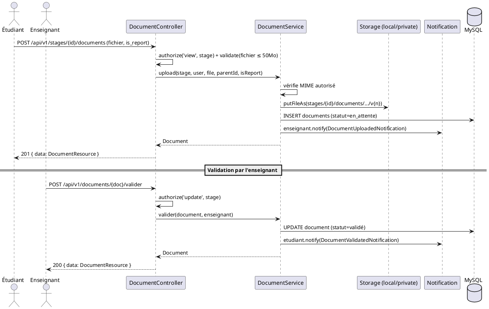
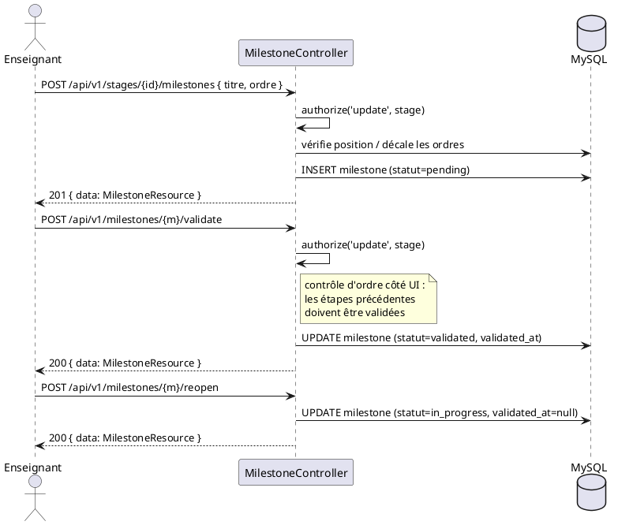

# Sprint 2 — Gestion de Stage (4 semaines)

> Projet **ScholarFlow** — Plateforme de gestion et de suivi des stages académiques
> Backend : Laravel 12 (PHP 8.2) · Frontend : Angular 16

---

## 1. Introduction

Ce sprint constitue le cœur métier de **ScholarFlow**. Il couvre l'ensemble du cycle de vie d'un
stage : création par l'enseignant, affectation d'étudiants (avec invitation par email), suivi de
l'avancement par étapes (*milestones*), dépôt et validation de documents (dont les rapports de
stage), et retour d'évaluation (*feedback*) noté.

L'enseignant pilote le stage : il définit le sujet, l'établissement, le niveau, le type
(été / PFE / PFA), invite les étudiants, structure le travail en étapes ordonnées qu'il valide
séquentiellement, contrôle les documents déposés (validation / refus / annotation des rapports)
et délivre des feedbacks. L'étudiant consulte son stage, dépose ses documents (et décide via un
modal si un fichier est son rapport officiel) et lit les retours.

Les autorisations reposent sur la `StagePolicy` (un enseignant n'agit que sur ses propres stages ;
un étudiant n'accède qu'aux stages où il est affecté et actif). Un stage `terminé` devient en
lecture seule (archivé).

---

## 2. Backlog du Sprint

| # | User Story | Priorité | Estimation |
|---|------------|----------|------------|
| US2.1 | En tant qu'enseignant, je veux créer un stage (titre, dates, établissement, niveau, type). | Haute | 3 j |
| US2.2 | En tant qu'enseignant, je veux modifier / supprimer un stage et changer son statut & rythme. | Haute | 2 j |
| US2.3 | En tant qu'utilisateur, je veux lister/consulter les stages qui me concernent. | Haute | 2 j |
| US2.4 | En tant qu'enseignant, je veux inviter des étudiants à un stage (email d'invitation). | Haute | 3 j |
| US2.5 | En tant qu'enseignant, je veux retirer un étudiant d'un stage. | Moyenne | 1 j |
| US2.6 | En tant qu'enseignant, je veux créer des étapes ordonnées et les modifier/supprimer. | Haute | 3 j |
| US2.7 | En tant qu'enseignant, je veux valider une étape (uniquement si l'étape précédente est validée) et la rouvrir. | Haute | 2 j |
| US2.8 | En tant qu'étudiant, je veux téléverser un document et indiquer s'il s'agit de mon rapport. | Haute | 3 j |
| US2.9 | En tant qu'enseignant, je veux valider / refuser un document et annoter un rapport (commentaire public + note privée). | Haute | 3 j |
| US2.10 | En tant qu'utilisateur, je veux télécharger un document via un lien signé. | Moyenne | 1 j |
| US2.11 | En tant qu'enseignant, je veux délivrer un feedback noté (/20) à un étudiant. | Haute | 2 j |
| US2.12 | En tant que système, je veux notifier les acteurs concernés (dépôt, validation, refus, feedback). | Haute | 2 j |

**DoD** : `StagePolicy` appliquée, validations en place, notifications déclenchées, stage `terminé`
en lecture seule, APIs testées.

---

## 3. Spécification

### 3.1. Diagramme de cas d'utilisation



### 3.2. Description textuelle

#### CU « Créer un stage »
| Champ | Détail |
|-------|--------|
| **Acteur** | Enseignant |
| **Pré-condition** | Authentifié, rôle `enseignant`, autorisé par `StagePolicy::create`. |
| **Scénario nominal** | 1. L'enseignant soumet titre, description, dates, niveau, type (`ete/pfe/pfa`), établissement. 2. La validation vérifie `date_fin > date_debut` et le format de l'année. 3. `StageService::create` persiste le stage et son `PublicChat` associé. |
| **Scénario alternatif** | 2a. `date_fin ≤ date_debut` → `422`. 2b. Établissement inexistant → `422`. |
| **Post-condition** | Stage créé (statut par défaut `actif`), salon de discussion de groupe initialisé. |

#### CU « Inviter des étudiants »
| Champ | Détail |
|-------|--------|
| **Acteur** | Enseignant |
| **Pré-condition** | `StagePolicy::affecter` (propriétaire du stage). |
| **Scénario nominal** | 1. L'enseignant fournit une liste `{ nom, prenom, email }`. 2. `StageService::affecterEtudiants` crée/réutilise les comptes étudiants, génère un jeton d'invitation et envoie l'email. 3. Une affectation `invité` est créée. |
| **Scénario alternatif** | 2a. Email déjà affecté → ignoré/réactivé. |
| **Post-condition** | Étudiants invités ; ils activeront leur compte (cf. Sprint 1). |

#### CU « Valider une étape »
| Champ | Détail |
|-------|--------|
| **Acteur** | Enseignant |
| **Pré-condition** | Étape non encore validée ; **toutes les étapes d'ordre inférieur sont validées**. |
| **Scénario nominal** | 1. L'enseignant clique « Valider ». 2. Le système vérifie l'ordre. 3. Statut → `validated`, `validated_at = now()`. |
| **Scénario alternatif** | 2a. Une étape précédente n'est pas validée → bouton désactivé (contrainte côté UI + autorisation `update` côté API). |
| **Post-condition** | Progression mise à jour ; l'étape compte dans l'avancement. |

#### CU « Téléverser un document »
| Champ | Détail |
|-------|--------|
| **Acteur** | Étudiant (ou enseignant) |
| **Pré-condition** | Accès au stage ; stage non `terminé`. |
| **Scénario nominal** | 1. L'utilisateur choisit un fichier. 2. (Étudiant) un modal demande s'il s'agit du rapport officiel. 3. `DocumentService::upload` stocke le fichier (disque `local/private`), crée le `Document` (statut `en_attente`). 4. Notification envoyée (enseignant si dépôt étudiant ; étudiants actifs si dépôt enseignant). |
| **Scénario alternatif** | 3a. MIME non autorisé → `InvalidArgumentException` → `422`. |
| **Post-condition** | Document versionné et disponible au téléchargement signé. |

#### CU « Valider / Refuser / Annoter un document »
| Champ | Détail |
|-------|--------|
| **Acteur** | Enseignant |
| **Pré-condition** | `StagePolicy::update`. |
| **Scénario nominal** | Valider → statut `validé` + notification. Refuser → statut `refusé` + motif obligatoire + notification. Annoter (rapport) → `teacher_comment` (visible étudiant) + `teacher_note` (privée). |
| **Post-condition** | L'étudiant est notifié et voit le commentaire public. |

---

## 4. Conception — Côté Backend

### 4.1. Diagramme de paquetages

```plantuml
@startuml PKG_Sprint2
skinparam packageStyle folder
skinparam linetype ortho

package "routes" {
  [api.php]
}

package "Http\\Controllers\\Api\\V1" {
  [StageController]
  [MilestoneController]
  [DocumentController]
  [FeedbackController]
  [EtablissementController]
}

package "Domain\\Stage\\Services" {
  [StageService]
  [MilestoneTemplateService]
}
package "Domain\\Document\\Services" {
  [DocumentService]
}
package "Domain\\Stage\\Policies" {
  [StagePolicy]
}
package "Domain\\*\\Notifications" {
  [InvitationNotification]
  [DocumentUploadedNotification]
  [DocumentValidatedNotification]
  [DocumentRefusedNotification]
  [DocumentDeposeParEnseignantNotification]
  [FeedbackReceivedNotification]
}

package "Models" {
  [Stage]
  [Affectation]
  [Milestone]
  [Document]
  [Feedback]
  [Etablissement]
  [User]
}

package "Http\\Resources\\V1" {
  [StageResource]
  [MilestoneResource]
  [DocumentResource]
  [FeedbackResource]
  [EtablissementResource]
  [AffectationResource]
}

package "Support\\Enums" {
  [StageStatut]
  [AffectationStatut]
  [MilestoneStatut]
  [DocumentStatut]
  [Semestre]
  [PaceIndicator]
}

[api.php] --> [StageController]
[api.php] --> [MilestoneController]
[api.php] --> [DocumentController]
[api.php] --> [FeedbackController]
[api.php] --> [EtablissementController]

[StageController] --> [StageService]
[StageController] --> [StagePolicy]
[StageController] --> [StageResource]
[MilestoneController] --> [Milestone]
[MilestoneController] --> [MilestoneResource]
[DocumentController] --> [DocumentService]
[DocumentController] --> [DocumentResource]
[FeedbackController] --> [Feedback]
[FeedbackController] --> [FeedbackResource]

[StageService] --> [Stage]
[StageService] --> [Affectation]
[StageService] --> [InvitationNotification]
[DocumentService] --> [Document]
[DocumentService] --> [DocumentUploadedNotification]
[DocumentService] --> [DocumentDeposeParEnseignantNotification]
[FeedbackController] --> [FeedbackReceivedNotification]

[Stage] --> [StageStatut]
[Stage] --> [Semestre]
[Stage] --> [PaceIndicator]
[Affectation] --> [AffectationStatut]
[Milestone] --> [MilestoneStatut]
[Document] --> [DocumentStatut]

@enduml
```



### 4.2. Diagramme de séquence — « Créer un stage + inviter des étudiants »



### 4.3. Diagramme de séquence — « Dépôt + validation d'un document »



### 4.4. Diagramme de séquence — « Cycle de vie d'une étape »



---

## 5. Réalisation

### 5.1. Côté Backend — Tests des APIs (cURL / Postman)

> Pré-requis : être authentifié comme **enseignant** (cf. Sprint 1 — `cookies.txt` + `$XSRF`).
> Base URL : `http://localhost`

#### US2.3 — Lister les stages

```bash
curl -s "http://localhost/api/v1/stages?per_page=10" \
  -b cookies.txt -H "Accept: application/json"
# 200 → { data:[...], meta:{ total, ... } }
```

#### US2.1 — Créer un stage

```bash
curl -s -X POST http://localhost/api/v1/stages \
  -b cookies.txt -c cookies.txt \
  -H "Content-Type: application/json" -H "Accept: application/json" \
  -H "X-XSRF-TOKEN: $XSRF" \
  -d '{
    "titre": "Optimisation IA pour la santé",
    "description": "Recherche appliquée en deep learning.",
    "date_debut": "2026-07-01",
    "date_fin": "2026-09-30",
    "niveau": "Master 2",
    "annee_academique": "2025-2026",
    "semestre": "pfe",
    "etablissement_id": 1
  }'
# 201 → { "data": { "id": 82, ... } }
```

#### US2.2 — Modifier un stage (statut + rythme)

```bash
curl -s -X PUT http://localhost/api/v1/stages/82 \
  -b cookies.txt -H "Content-Type: application/json" -H "Accept: application/json" \
  -H "X-XSRF-TOKEN: $XSRF" \
  -d '{ "statut": "actif", "pace_indicator": "on_track" }'
# 200 → { "data": { ... } }
```

#### US2.4 — Inviter des étudiants

```bash
curl -s -X POST http://localhost/api/v1/stages/82/affectations \
  -b cookies.txt -H "Content-Type: application/json" -H "Accept: application/json" \
  -H "X-XSRF-TOKEN: $XSRF" \
  -d '{
    "etudiants": [
      { "nom": "Lefebvre", "prenom": "Sophie", "email": "sophie@univ.tn" },
      { "nom": "Mansour",  "prenom": "Karim",  "email": "karim@univ.tn"  }
    ]
  }'
# 201 → { "message": "2 étudiant(s) invité(s)." }
```

#### US2.5 — Retirer un étudiant

```bash
curl -s -X DELETE http://localhost/api/v1/stages/82/affectations/100 \
  -b cookies.txt -H "Accept: application/json" -H "X-XSRF-TOKEN: $XSRF"
# 204 No Content
```

#### US2.6 / US2.7 — Étapes (créer, valider, rouvrir)

```bash
# Créer
curl -s -X POST http://localhost/api/v1/stages/82/milestones \
  -b cookies.txt -H "Content-Type: application/json" -H "Accept: application/json" \
  -H "X-XSRF-TOKEN: $XSRF" \
  -d '{ "titre": "Conception et planification", "description": "Cadrage", "ordre": 1 }'
# 201 → { data:{ id: 5, statut:"pending" } }

# Valider l'étape 5
curl -s -X POST http://localhost/api/v1/milestones/5/validate \
  -b cookies.txt -H "Accept: application/json" -H "X-XSRF-TOKEN: $XSRF"
# 200 → { data:{ statut:"validated", validated_at:"..." } }

# Rouvrir
curl -s -X POST http://localhost/api/v1/milestones/5/reopen \
  -b cookies.txt -H "Accept: application/json" -H "X-XSRF-TOKEN: $XSRF"
# 200 → { data:{ statut:"in_progress" } }
```

#### US2.8 — Téléverser un document (multipart)

```bash
# Étudiant : dépôt d'un rapport
curl -s -X POST http://localhost/api/v1/stages/82/documents \
  -b cookies.txt -H "Accept: application/json" -H "X-XSRF-TOKEN: $XSRF" \
  -F "fichier=@/chemin/vers/rapport.pdf" \
  -F "is_report=1"
# 201 → { data:{ id:3, statut:"en_attente", is_report:true } }
```

#### US2.9 — Valider / Refuser / Annoter un document

```bash
# Valider
curl -s -X POST http://localhost/api/v1/documents/3/valider \
  -b cookies.txt -H "Accept: application/json" -H "X-XSRF-TOKEN: $XSRF"
# 200 → { data:{ statut:"validé" } }

# Refuser (motif obligatoire)
curl -s -X POST http://localhost/api/v1/documents/3/refuser \
  -b cookies.txt -H "Content-Type: application/json" -H "Accept: application/json" \
  -H "X-XSRF-TOKEN: $XSRF" \
  -d '{ "commentaire": "Veuillez ajouter la bibliographie." }'
# 200 → { data:{ statut:"refusé", commentaire:"..." } }

# Annoter un rapport (commentaire public + note privée)
curl -s -X POST http://localhost/api/v1/documents/3/annotate \
  -b cookies.txt -H "Content-Type: application/json" -H "Accept: application/json" \
  -H "X-XSRF-TOKEN: $XSRF" \
  -d '{ "teacher_comment": "Bon travail global.", "teacher_note": "À surveiller la partie 3." }'
# 200 → { data:{ teacher_comment:"...", teacher_note:"..." } }
```

#### US2.10 — Télécharger un document (lien signé)

```bash
# L'URL signée (expires + signature) est fournie par DocumentResource.download_url
curl -s -L "http://localhost/api/v1/documents/3/download?expires=...&signature=..." \
  -b cookies.txt -o rapport_telecharge.pdf
# 200 → fichier binaire
```

#### US2.11 — Donner un feedback noté

```bash
curl -s -X POST http://localhost/api/v1/stages/82/feedbacks \
  -b cookies.txt -H "Content-Type: application/json" -H "Accept: application/json" \
  -H "X-XSRF-TOKEN: $XSRF" \
  -d '{
    "etudiant_id": 100,
    "contenu": "Très bonne progression sur la phase de conception, continuez ainsi.",
    "note": 16.5
  }'
# 201 → { data:{ id:7, note:16.5 } }
# Remarque : contenu min 20 / max 3000 caractères.
```

#### Référence — Lister les établissements

```bash
curl -s http://localhost/api/v1/etablissements \
  -b cookies.txt -H "Accept: application/json"
# 200 → { data:[ { id, nom, code, ville } ] }
```

### 5.2. Côté Frontend — Interfaces réalisées

- **Liste des stages** (`/stages`) avec filtres de session (année / semestre / établissement).
- **Formulaire de stage** (`/stages/nouveau`, `/stages/:id/modifier`) — champs requis marqués `*`, badge type, année auto.
- **Page détail du stage** (`/stages/:id`) avec onglets : Aperçu, Étapes, Étudiants, Documents, Réunions, Discussion ; badge du type dans le titre ; bannière « archivé » si `terminé`.
- **Onglet Étapes** — timeline avec roue de complétion, validation séquentielle (bouton désactivé tant que l'étape précédente n'est pas validée).
- **Onglet Documents** — téléversement avec modal « Soumettre comme rapport ? », validation/refus/annotation côté enseignant.
- **Onglet Étudiants** — invitation, retrait, bouton de discussion privée.
- **Onglet Aperçu** — feedbacks notés (compteur de caractères, min 20).

> *(Captures d'écran des interfaces à insérer ici.)*

---

## 6. Conclusion

Ce sprint a livré le module métier central de ScholarFlow : gestion complète des stages
(CRUD + statut + rythme), affectation d'étudiants par invitation email, suivi par étapes ordonnées
avec validation séquentielle, gestion documentaire versionnée (dépôt, rapport, validation, refus,
annotation publique/privée, téléchargement signé) et feedback noté. Les autorisations fines
(`StagePolicy`) et le mode lecture seule des stages archivés garantissent l'intégrité du flux. Les
notifications déclenchées à chaque évènement préparent le **Sprint 3 — Tableaux de bord,
messagerie/notifications temps réel et amélioration UI/UX**.
