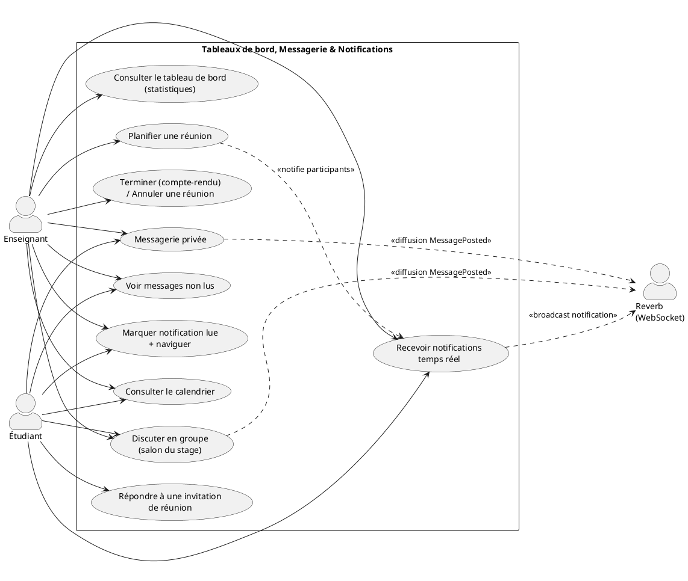
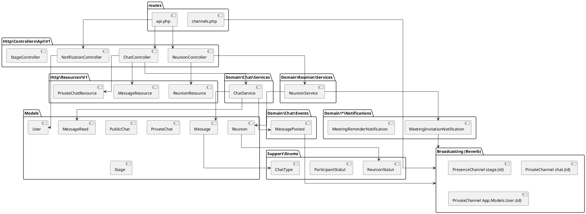
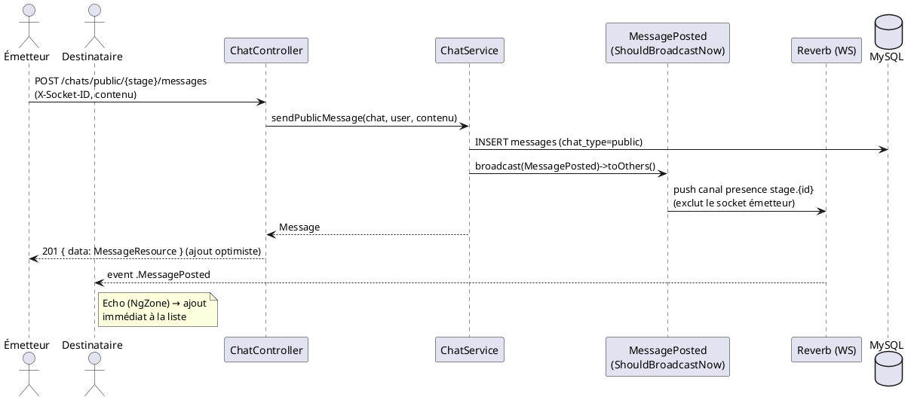
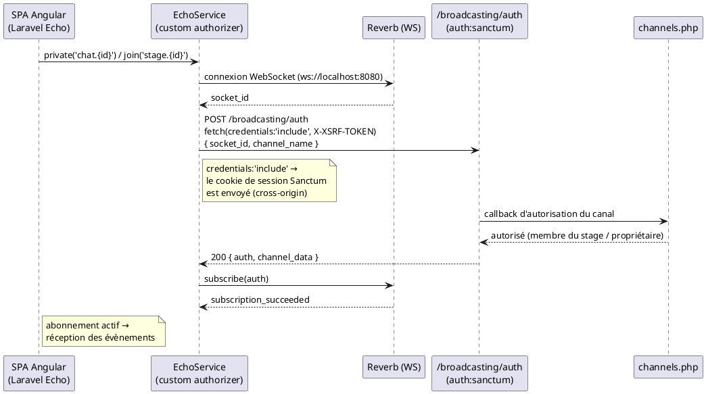
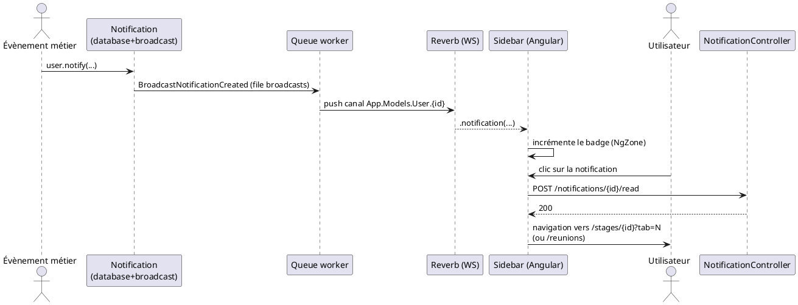

# Sprint 3 — Tableaux de bord, Messagerie / Notifications & Amélioration UI/UX (4 semaines)

> Projet **ScholarFlow** — Plateforme de gestion et de suivi des stages académiques
> Backend : Laravel 12 (PHP 8.2) · Temps réel : Laravel Reverb (WebSocket) · Frontend : Angular 16 + Laravel Echo

---

## 1. Introduction

Ce dernier sprint enrichit l'expérience utilisateur de **ScholarFlow** avec trois axes :

1. **Tableaux de bord** : statistiques agrégées pour l'enseignant (stages actifs, terminés,
   récents, étudiants) et calendrier des réunions.
2. **Messagerie & notifications temps réel** : discussion de groupe par stage (salon public),
   messagerie privée enseignant ↔ étudiant, et notifications poussées en direct via **Laravel
   Reverb** (WebSocket) — sans rechargement de page. Gestion des compteurs de non-lus.
3. **Réunions** : planification de réunions (avec lien Google Meet), clôture avec compte-rendu,
   annulation, et calendrier mensuel interactif.
4. **Amélioration UI/UX** : calendrier mensuel cliquable, badges de non-lus, codes couleur par
   établissement, navigation contextuelle depuis les notifications, cohérence visuelle globale.

Le défi technique majeur a été la fiabilisation du temps réel : authentification des canaux privés
cross-origin (custom *authorizer* avec `credentials: 'include'`), exécution des callbacks WebSocket
dans la zone Angular (`NgZone`), et exclusion de l'émetteur de ses propres diffusions (`toOthers`
via l'en-tête `X-Socket-ID`).

---

## 2. Backlog du Sprint

| # | User Story | Priorité | Estimation |
|---|------------|----------|------------|
| US3.1 | En tant qu'enseignant, je veux un tableau de bord avec mes statistiques (actifs, terminés, récents). | Haute | 3 j |
| US3.2 | En tant qu'utilisateur, je veux planifier une réunion (sujet, date, durée, lien Meet, participants). | Haute | 3 j |
| US3.3 | En tant qu'enseignant, je veux terminer une réunion avec un compte-rendu, ou l'annuler. | Haute | 2 j |
| US3.4 | En tant qu'utilisateur, je veux un calendrier mensuel des réunions cliquable (sélection mois/année). | Haute | 3 j |
| US3.5 | En tant qu'utilisateur, je veux discuter en groupe dans le salon du stage en temps réel. | Haute | 3 j |
| US3.6 | En tant qu'enseignant/étudiant, je veux une messagerie privée en temps réel. | Haute | 3 j |
| US3.7 | En tant qu'utilisateur, je veux voir le nombre de messages privés non lus (badge sidebar + par conversation). | Moyenne | 2 j |
| US3.8 | En tant qu'utilisateur, je veux recevoir mes notifications en temps réel et les marquer lues. | Haute | 3 j |
| US3.9 | En tant qu'utilisateur, je veux qu'une notification m'amène à la page concernée au clic. | Moyenne | 2 j |
| US3.10 | En tant que système, je veux fiabiliser le temps réel (auth canaux, NgZone, toOthers). | Haute | 3 j |

**DoD** : diffusions temps réel fonctionnelles sans rechargement, pas de doublon côté émetteur,
compteurs de non-lus exacts, navigation contextuelle opérationnelle.

---

## 3. Spécification

### 3.1. Diagramme de cas d'utilisation



### 3.2. Description textuelle

#### CU « Consulter le tableau de bord »
| Champ | Détail |
|-------|--------|
| **Acteur** | Enseignant |
| **Pré-condition** | Authentifié, rôle `enseignant`. |
| **Scénario nominal** | 1. Le système agrège : stages actifs, stages terminés, stages récents, nombre d'étudiants — filtrés par la session active (année/semestre/établissement). 2. Les compteurs sont affichés dans la carte « Analyses d'Impact ». |
| **Post-condition** | Vue synthétique de l'activité de l'enseignant. |

#### CU « Planifier une réunion »
| Champ | Détail |
|-------|--------|
| **Acteur** | Enseignant |
| **Pré-condition** | `StagePolicy::update` ; stage non `terminé`. |
| **Scénario nominal** | 1. L'enseignant saisit sujet, date (future), durée, lien Meet, participants. 2. `ReunionService::planifier` crée la réunion et notifie les participants (email + notification + temps réel). |
| **Scénario alternatif** | 1a. Date dans le passé → `422` (message convivial côté UI). |
| **Post-condition** | Réunion `planifiée` visible dans le calendrier. |

#### CU « Discuter en groupe (temps réel) »
| Champ | Détail |
|-------|--------|
| **Acteur** | Enseignant / Étudiant (membre actif du stage) |
| **Pré-condition** | Accès autorisé au `PublicChat` du stage. |
| **Scénario nominal** | 1. L'émetteur envoie un message. 2. `ChatService::sendPublicMessage` persiste et diffuse `MessagePosted` sur le canal de présence `stage.{id}` via `broadcast()->toOthers()`. 3. Les autres membres reçoivent le message instantanément. |
| **Scénario alternatif** | 2a. L'émetteur est exclu de sa propre diffusion grâce à `X-Socket-ID`. |
| **Post-condition** | Message affiché chez tous les membres sans rechargement. |

#### CU « Messagerie privée + non-lus »
| Champ | Détail |
|-------|--------|
| **Acteur** | Enseignant ↔ Étudiant |
| **Scénario nominal** | 1. Diffusion `MessagePosted` sur le canal privé `chat.{id}`. 2. À l'ouverture d'une conversation, les messages sont marqués lus (`message_reads`). 3. Les compteurs de non-lus (badge sidebar + par conversation) sont recalculés. |
| **Post-condition** | Compteurs exacts ; badge rouge sur « Messagerie » si non-lus. |

#### CU « Recevoir une notification temps réel »
| Champ | Détail |
|-------|--------|
| **Acteur** | Utilisateur authentifié |
| **Scénario nominal** | 1. Un évènement métier (réunion planifiée, document déposé/validé/refusé, feedback) déclenche une `Notification` (canaux `database` + `broadcast`). 2. Reverb pousse la notification sur le canal privé `App.Models.User.{id}`. 3. Le badge de non-lus s'incrémente en direct. 4. Au clic, l'utilisateur est routé vers la page concernée et la notification est marquée lue. |
| **Post-condition** | Notification consultée, compteur à jour. |

---

## 4. Conception — Côté Backend

### 4.1. Diagramme de paquetages



### 4.2. Diagramme de séquence — « Message de groupe en temps réel »



### 4.3. Diagramme de séquence — « Authentification d'un canal privé (temps réel) »



### 4.4. Diagramme de séquence — « Notification temps réel + navigation »



---

## 5. Réalisation

### 5.1. Côté Backend — Tests des APIs (cURL / Postman)

> Pré-requis : authentifié (cf. Sprint 1 — `cookies.txt` + `$XSRF`). Base URL : `http://localhost`
> Le temps réel (WebSocket) se teste depuis le navigateur ; les APIs ci-dessous couvrent la
> persistance et le déclenchement des diffusions.

#### US3.1 — Tableau de bord (statistiques via la liste filtrée)

```bash
# Stages actifs
curl -s "http://localhost/api/v1/stages?filter%5Bstatut%5D=actif&per_page=1" \
  -b cookies.txt -H "Accept: application/json"
# → meta.total = nombre de stages actifs

# Stages terminés
curl -s "http://localhost/api/v1/stages?filter%5Bstatut%5D=termin%C3%A9&per_page=1" \
  -b cookies.txt -H "Accept: application/json"
# → meta.total = nombre de stages terminés
```

#### US3.2 — Planifier une réunion

```bash
curl -s -X POST http://localhost/api/v1/stages/82/reunions \
  -b cookies.txt -H "Content-Type: application/json" -H "Accept: application/json" \
  -H "X-XSRF-TOKEN: $XSRF" \
  -d '{
    "sujet": "Point d avancement mi-stage",
    "description": "Revue des livrables.",
    "scheduled_at": "2026-07-15T09:00:00",
    "duration_minutes": 60,
    "meet_url": "https://meet.google.com/abc-defg-hij",
    "participant_ids": [100, 101]
  }'
# 201 → { data:{ id:12, statut:"planifiée" } }
```

#### US3.4 — Lister les réunions (calendrier)

```bash
curl -s "http://localhost/api/v1/reunions?per_page=100" \
  -b cookies.txt -H "Accept: application/json"
# 200 → { data:[ { id, sujet, scheduled_at, statut, stage:{ etablissement } } ] }
```

#### US3.3 — Terminer une réunion (compte-rendu) / Annuler

```bash
# Terminer avec compte-rendu
curl -s -X POST http://localhost/api/v1/reunions/12/terminer \
  -b cookies.txt -H "Content-Type: application/json" -H "Accept: application/json" \
  -H "X-XSRF-TOKEN: $XSRF" \
  -d '{ "compte_rendu": "Décisions: figer le périmètre. Actions: livrer la maquette." }'
# 200 → { data:{ statut:"terminée", compte_rendu:"...", terminated_at:"..." } }

# Annuler
curl -s -X POST http://localhost/api/v1/reunions/12/annuler \
  -b cookies.txt -H "Accept: application/json" -H "X-XSRF-TOKEN: $XSRF"
# 200 → { data:{ statut:"annulée" } }
```

#### US3.4bis — Répondre à une invitation de réunion (participant)

```bash
curl -s -X POST http://localhost/api/v1/reunions/12/participants/100/reponse \
  -b cookies.txt -H "Content-Type: application/json" -H "Accept: application/json" \
  -H "X-XSRF-TOKEN: $XSRF" \
  -d '{ "statut": "accepté" }'
# 200 → { message:"Réponse enregistrée." }
```

#### US3.5 — Discussion de groupe (salon public)

```bash
# Lire les messages du salon du stage (publicChat lié au stage_id)
curl -s "http://localhost/api/v1/chats/public/82/messages" \
  -b cookies.txt -H "Accept: application/json"

# Envoyer un message (déclenche la diffusion temps réel MessagePosted)
curl -s -X POST http://localhost/api/v1/chats/public/82/messages \
  -b cookies.txt -H "Content-Type: application/json" -H "Accept: application/json" \
  -H "X-XSRF-TOKEN: $XSRF" \
  -d '{ "contenu": "Bonjour à tous, réunion demain à 9h." }'
# 201 → { data: MessageResource }
```

#### US3.6 — Messagerie privée

```bash
# Démarrer/obtenir une conversation privée avec un utilisateur
curl -s -X POST http://localhost/api/v1/chats/private \
  -b cookies.txt -H "Content-Type: application/json" -H "Accept: application/json" \
  -H "X-XSRF-TOKEN: $XSRF" \
  -d '{ "user_id": 100 }'
# 200 → { data:{ id:4, enseignant, etudiant } }

# Lister mes conversations (avec unread_count par conversation)
curl -s http://localhost/api/v1/chats/private \
  -b cookies.txt -H "Accept: application/json"

# Envoyer un message privé (diffusion temps réel sur chat.{id})
curl -s -X POST http://localhost/api/v1/chats/private/4/messages \
  -b cookies.txt -H "Content-Type: application/json" -H "Accept: application/json" \
  -H "X-XSRF-TOKEN: $XSRF" \
  -d '{ "contenu": "Pouvez-vous m envoyer la dernière version ?" }'
# 201 → { data: MessageResource }
```

#### US3.7 — Compteurs de messages non lus

```bash
# Total non lus (badge sidebar)
curl -s http://localhost/api/v1/chats/private/unread-count \
  -b cookies.txt -H "Accept: application/json"
# 200 → { data:{ unread_count: 3 } }

# Marquer une conversation entière comme lue
curl -s -X POST http://localhost/api/v1/chats/private/4/read \
  -b cookies.txt -H "Accept: application/json" -H "X-XSRF-TOKEN: $XSRF"
# 200 → { message:"Conversation marquée comme lue." }
```

#### US3.8 / US3.9 — Notifications

```bash
# Lister les notifications
curl -s http://localhost/api/v1/notifications \
  -b cookies.txt -H "Accept: application/json"
# 200 → { data:[ { id, type, data:{ type, stage_id, ... }, read_at } ] }

# Marquer une notification comme lue
curl -s -X POST http://localhost/api/v1/notifications/NOTIF_UUID/read \
  -b cookies.txt -H "Accept: application/json" -H "X-XSRF-TOKEN: $XSRF"
# 200

# Tout marquer comme lu
curl -s -X POST http://localhost/api/v1/notifications/read-all \
  -b cookies.txt -H "Accept: application/json" -H "X-XSRF-TOKEN: $XSRF"
# 200
```

#### US3.10 — Vérification temps réel (procédure navigateur)

```text
1. Ouvrir deux navigateurs : compte A (enseignant) et compte B (étudiant) sur le même stage.
2. Onglet « Discussion » : A envoie un message → B le voit instantanément (sans rafraîchir),
   et A ne le voit qu'une seule fois (toOthers + X-Socket-ID).
3. Messagerie privée : idem ; le badge de non-lus de B s'incrémente en direct.
4. A planifie une réunion → B reçoit une notification temps réel (badge incrémenté).
Vérifier dans l'onglet Réseau : la requête POST /broadcasting/auth renvoie 200 (cookie envoyé).
```

> **Import Postman** : une *Collection* « ScholarFlow – Sprint 3 » regroupe ces requêtes, avec la
> variable d'environnement `base_url` et l'en-tête `X-Socket-ID` (optionnel pour les tests REST,
> requis seulement pour la déduplication temps réel).

### 5.2. Côté Frontend — Interfaces réalisées

- **Tableau de bord enseignant** — carte « Analyses d'Impact » (stages actifs, **terminés**, récents),
  badge du type de stage sur les cartes, raccourcis (nouveau stage, calendrier).
- **Calendrier** (`/reunions`) — grille mensuelle cliblable, sélection mois/année par menus déroulants,
  bouton « Aujourd'hui », chips de réunions cliquables (→ détail du stage), code couleur par
  établissement (enseignant), légende au-dessus de la grille, onglet « Passées ».
- **Onglet Réunions (détail stage)** — créer, terminer (compte-rendu inline), annuler (confirmation).
- **Discussion de groupe** (onglet du stage) — messages en temps réel.
- **Messagerie** (`/messagerie`) — liste des conversations avec badge de non-lus par conversation,
  fenêtre de chat temps réel, marquage lu à l'ouverture, bouton de chat depuis l'onglet Étudiants.
- **Notifications** (`/notifications`) — puces de type colorées (réunion, document, feedback…),
  navigation contextuelle au clic, « Tout marquer comme lu » (mise à jour immédiate des badges).
- **Sidebar** — badge rouge de non-lus sur « Notifications » et « Messagerie », temps réel.
- **Fiabilisation temps réel** — `EchoService` (custom authorizer `credentials:'include'`, NgZone,
  `socketId()` + en-tête `X-Socket-ID` via intercepteur) ; corrections de doublons d'envoi.

> *(Captures d'écran des interfaces à insérer ici.)*

---

## 6. Conclusion

Ce sprint final a transformé ScholarFlow en une plateforme collaborative temps réel : tableaux de
bord synthétiques, calendrier mensuel interactif, planification de réunions avec comptes-rendus,
discussion de groupe et messagerie privée instantanées, et notifications poussées via Laravel Reverb.
La fiabilisation du temps réel — authentification cross-origin des canaux privés, exécution dans
`NgZone`, exclusion de l'émetteur via `X-Socket-ID` — ainsi que la gestion fine des compteurs de
non-lus offrent une expérience fluide et cohérente. Les améliorations UI/UX transversales (badges,
codes couleur, navigation contextuelle, mode lecture seule des stages archivés) finalisent un produit
complet et abouti.
